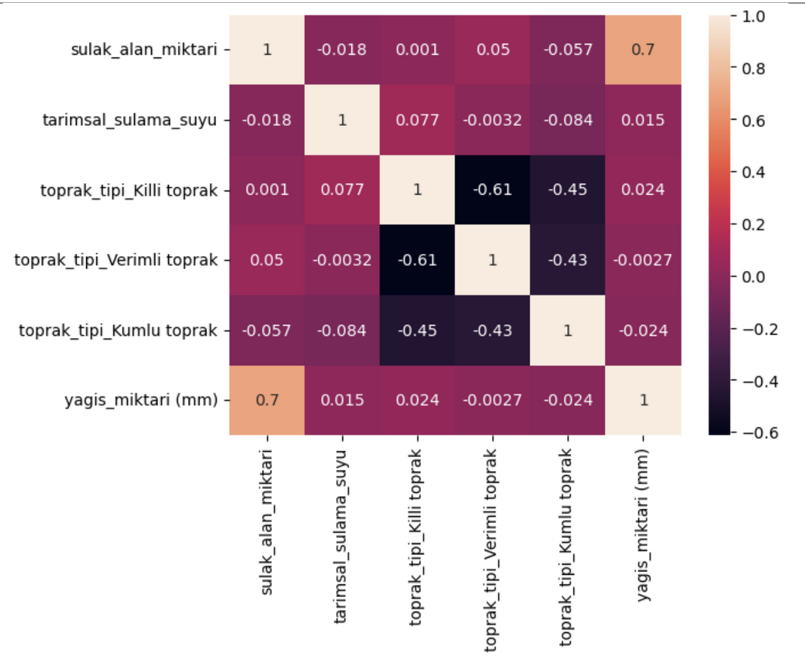
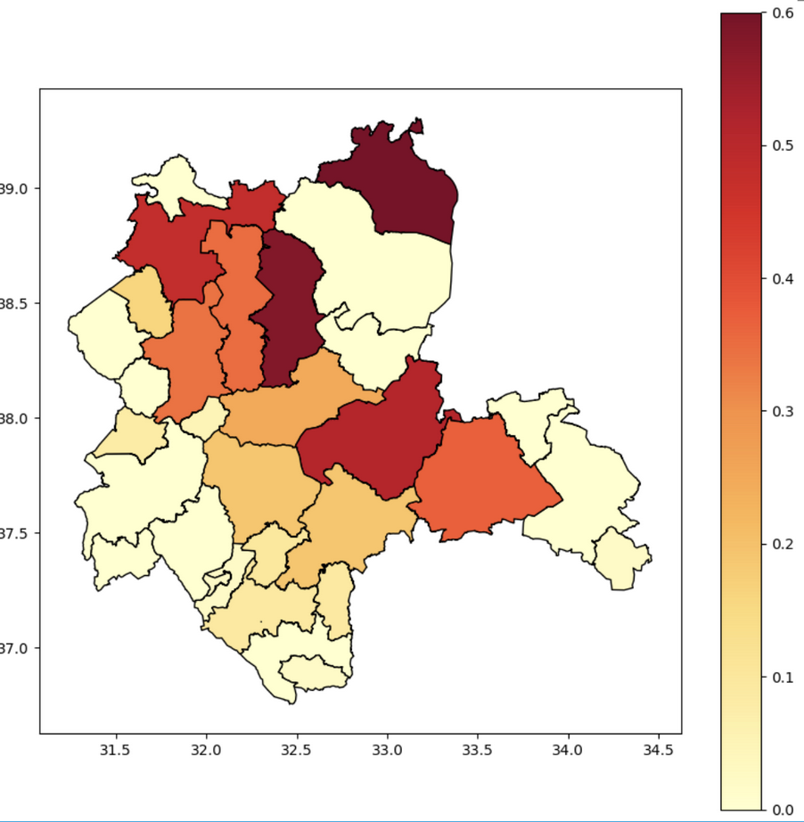
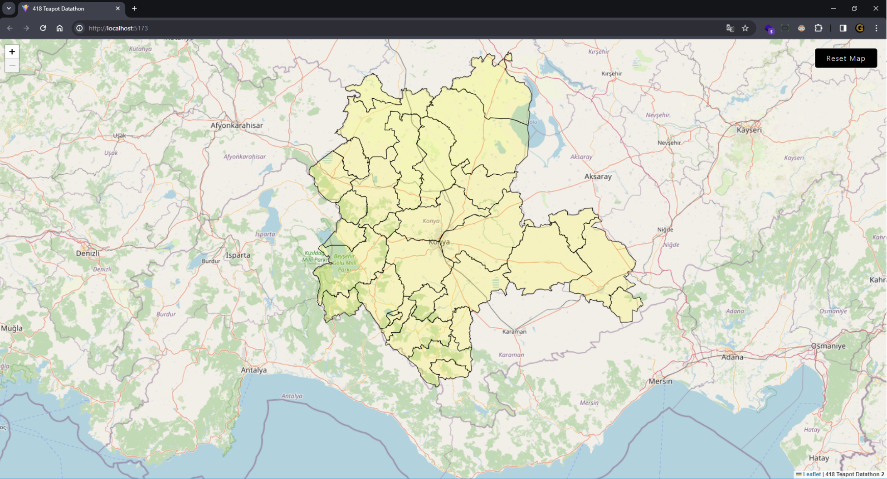
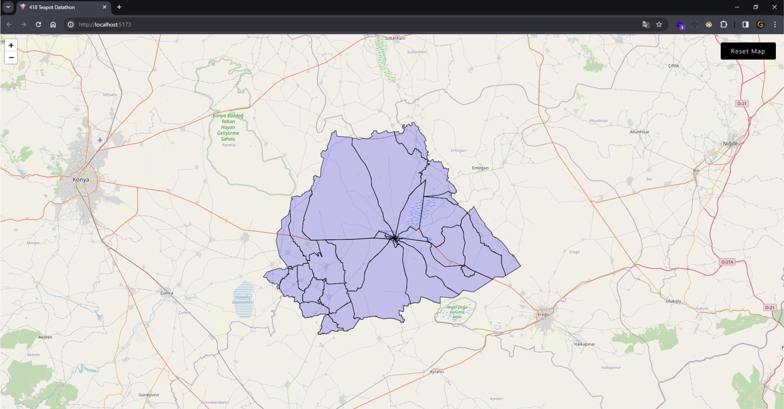
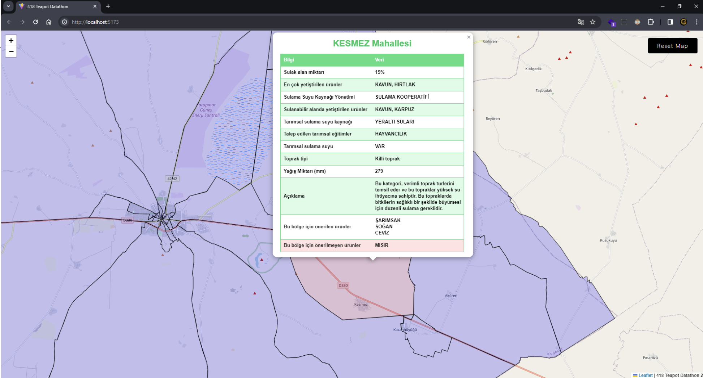
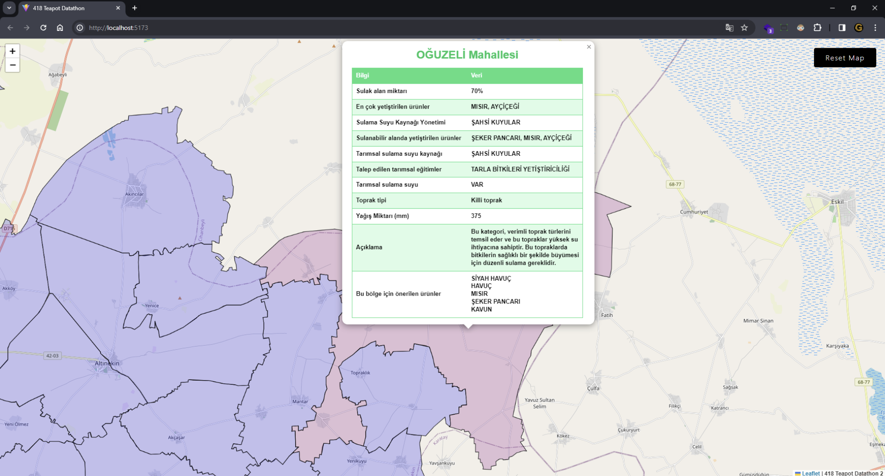
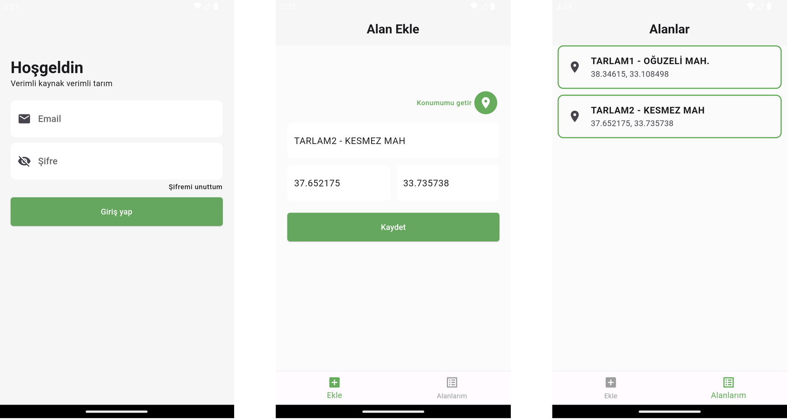
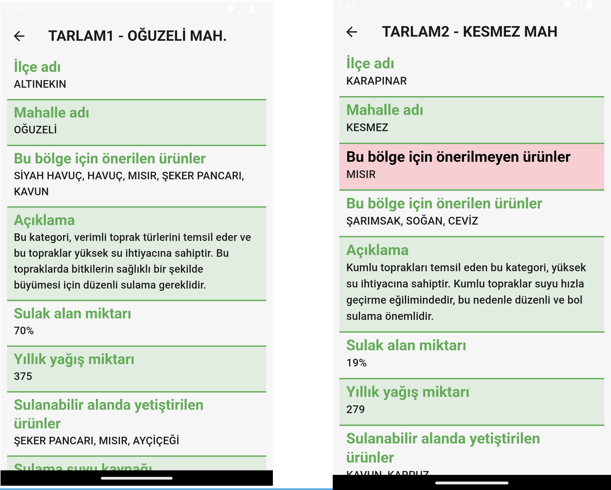

# Earth Source Products

## Problem Statement

The depletion of Water Resources: Cultivating high-water-demand crops can lead to excessive depletion of both underground and surface water sources.

Economic Losses: Cultivating high-water-demand crops in water-scarce regions results in agriculture being economically unsustainable.

Sinkhole Formation: Unconscious water consumption exacerbates the issue.

## Our Objective

Through analysis based on factors such as the location of the plot, the status of water resources, and soil conditions:

To mitigate uncontrolled irrigation practices in agriculture.

To provide relevant information to municipal/government officials regarding the status of fields and gardens in respective districts and neighborhoods.

To enhance agricultural policies and irrigation practices for greater effectiveness.

To enable citizens to determine suitable crops for their gardens or fields through analysis.

## Our Solution

Utilizing artificial intelligence, we provide farmers and governmental institutions with web and mobile applications offering regional climate and soil analyses, along with compatible crop recommendations. This encourages water conservation and promotes sustainable agricultural practices.

## Technologies

Machine Learning:
Decision Tree Classification Algorithm

Libraries/Frameworks:
Scikit-learn (Sklearn) for implementing machine learning algorithms:
OneHotEncoder for categorical feature encoding.
StandardScaler for feature scaling.
DecisionTreeClassifier for decision tree-based classification.

FastAPI:
For developing the API to facilitate communication between different components of the system.

## Data Analysies

## PROJECT PRESENTATION

[Earth Source Products Presentation](https://docs.google.com/presentation/d/1kQJMlb9VuDiwWbQ2MNZyqfTQXIMKGuht/edit#slide=id.p1)

 

 

 

 

 

 
